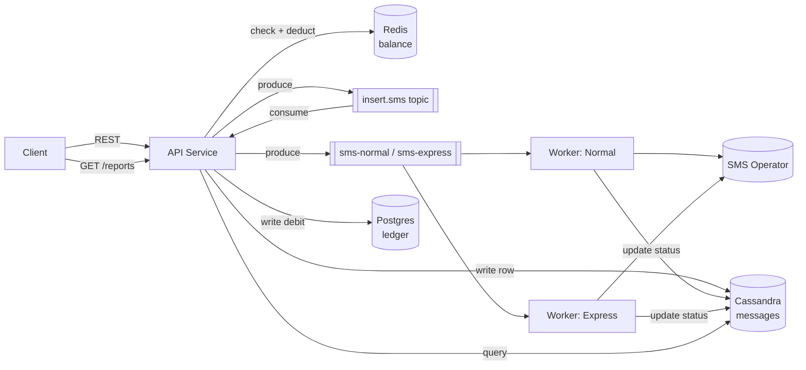

# SMS Gateway — Technical Design Document

## 1. Overview

The SMS Gateway allows customers to send SMS messages via a REST API against a
prepaid balance, with two priority tiers (normal, express) and a reporting
endpoint for sent messages. The system is designed for ~105 million SMS/day
with a highly non-uniform load distribution across customers.

## 2. Functional Requirements Recap

- REST API only, no authentication/user management.
- ~105M SMS/day; sending rate varies widely per customer.
- Express mode with a monitored delivery-time target to the operator.
- Customers can use their full balance; no sends accepted once balance is 0.
- Customers can retrieve reports of their sent messages.

## 3. High-Level Architecture




## 4. Components

**API Service (`serve-api`)**
Receives the SMS request, performs an atomic balance check-and-deduct against
Redis, publishes the send event to Kafka, and responds to the client. Both
the Redis operation and the Kafka publish are synchronous — the client waits
on both before receiving a response, keeping the write path simple and the
client always informed of the true outcome.
then the consumer get the sms event and add the debit to the ledger and write the message to Cassandra.

**Workers (`worker-normal`, `worker-express`)**
Separate deployable services, each consuming from its own Kafka topic, so 
express capacity can be scaled and provisioned independently from normal traffic. 
Each worker uses multiple goroutines per partition claim for concurrency, 
calls the operator API, updates message status in Cassandra, 
and writes the corresponding ledger entry in Postgres.

**Operator Integration**
A single SMS operator is used for delivery.

## 5. Data Model

**`ledger` (Postgres)** — append-only audit trail of every debit and topup.
```
customer_id   text
id            uuid
amount        bigint      -- negative for debit, positive for topup
message_id    text        -- unique, links to the messages table
created_at    timestamp
```

**`messages` (Cassandra)** — one row per SMS, used for reporting.
```
customer_id   text (partition key)
id            uuid (clustering key)
to_number     text
text          text
priority      text
status        text        -- queued | sent | failed
created_at    timestamp
sent_at       timestamp
```

## 6. Balance Management

**Hot path.** Every send performs an atomic Redis check-and-deduct (Lua
script), guaranteeing no two concurrent requests can push a balance negative.

**Cache-miss recovery.** If a customer's balance key isn't in Redis (e.g.
after a restart), it's rebuilt by summing that customer's full ledger
history:
```
balance = SUM(ledger.amount WHERE customer_id = ?)
```
This is a rare event (Redis restart or first-ever request), so a full-history
sum is an acceptable cost at the current design stage.(Read: Future Improvements, below, for a more efficient approach.)

**Topup.** Handled synchronously: ledger insert, followed by a Redis balance
increment, then respond to the client.

## 7. Messaging (Kafka)

Two topics separate priority classes: `sms-normal` and `sms-express`, so
express traffic is never queued behind bulk traffic.

**Partitioning.** Partition key is `customer_id + random_bucket` rather than
`customer_id` alone. Given the non-uniform load, a pure `customer_id` key
would concentrate a single heavy sender's traffic on one partition,
bottlenecking that partition's consumer while others sit idle. Bucketing
spreads one customer's messages across many partitions at the cost of
per-customer ordering, which is acceptable for SMS delivery.

Consumers (kafka-go, consumer-group mode) process partitions in parallel,
and each partition's messages are further fanned out to a small pool of
goroutines to overlap operator-call latency.

## 8. Express SLA Handling

- A dedicated, independently-scaled worker pool (`worker-express`) with
  headroom provisioned ahead of expected bursts, rather than relying solely
  on reactive autoscaling.

## 9. Future Improvements

- **Backup/failover operator for express** — routing express traffic to a
  secondary operator when the primary is unhealthy, removing the current
  single-operator dependency for the SLA-sensitive path.
- **Checkpointed balance for faster cache-miss recovery** — as ledger history
  grows per customer, summing the full history on every cache miss becomes
  more expensive. A checkpoint mechanism would address this: add a
  `processed` boolean column to `ledger`, and reintroduce a `balances` table
  holding each customer's balance as of their last checkpoint. A background
  job — run during low-traffic hours — sums each customer's unprocessed
  entries, folds the result into `balances.current_balance`, and marks those
  rows `processed = true`. Keeping the unprocessed row count below a tunable
  threshold means a cache-miss SUM only ever scans a bounded number of rows,
  regardless of the customer's total history. During a customer's checkpoint
  run, a Redis-based lock would briefly block new sends/topups for that
  customer to keep the running total and the checkpoint consistent — an
  acceptable tradeoff if scheduled off-peak.

## 10. Tech Stack Summary

| Layer | Technology |
|---|---|
| API / Workers | Go, Cobra (subcommands: serve-api, worker-normal, worker-express) |
| Messaging | Kafka (kafka-go) |
| Balance cache | Redis |
| Ledger / checkpoint | Postgres |
| Message reports | Cassandra |